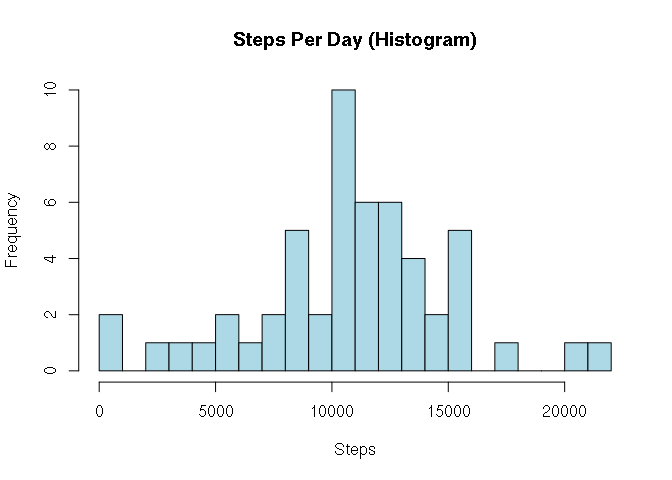
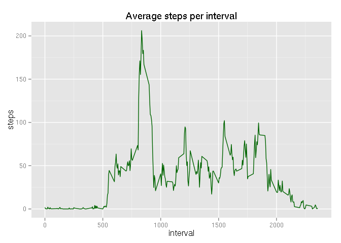
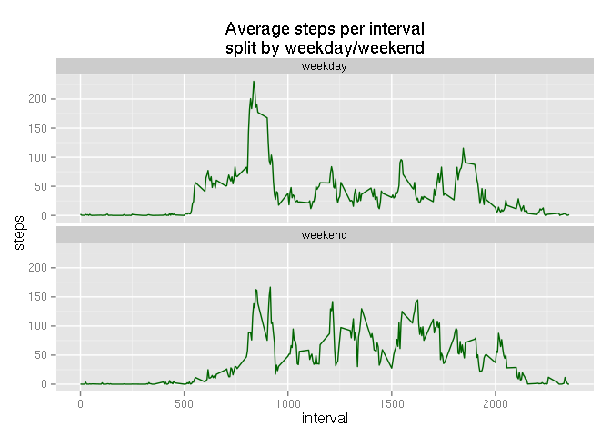

# Reproducible Research: Peer Assessment 1
Devon Smith  
05/15/2015  

***

### Loading and preprocessing the data  
Show any code that is needed to

1. Load the data (i.e. read.csv())
2. Process/transform the data (if necessary) into a format suitable for your analysis


```r
zipFile <- "activity.zip"
csvFile <- "activity.csv"

if ( ! zipFile %in% dir() ) stop("Zip file not found - exiting")
unzip(zipFile)
if ( ! csvFile %in% dir() ) stop("CSV file not found - exiting")
activity <- read.csv(csvFile, na.strings="NA")
```

***
### What is mean total number of steps taken per day?

For this part of the assignment, you can ignore the missing values in the dataset.

- Calculate the total number of steps taken per day

```r
# Aggregate the steps taken per date, summing the values
aggSum <- with(activity, aggregate(steps ~ date, FUN=sum))
```

- If you do not understand the difference between a histogram and a barplot, research the difference between them. Make a histogram of the total number of steps taken each day

```r
hist(aggSum$steps,breaks=20,col="lightblue", main="Steps Per Day (Histogram)",xlab="Steps")
```

 

- Calculate and report the mean and median of the total number of steps taken per day

```r
meanStepsPerDay <- mean(aggSum$steps)
medianStepsPerDay <- median(aggSum$steps)
```

> The mean steps per day is **10766.19** and the
> median is **10765** 


***
### What is the average daily activity pattern?

- Make a time series plot (i.e. type = "l") of the 5-minute interval (x-axis) and the average number of steps taken, averaged across all days (y-axis)

```r
library(ggplot2)
# Aggregate the steps across intervals, calculating the mean
aggMean <- with(activity, aggregate(steps ~ interval, FUN=mean))
meanPlot <- ggplot(data=aggMean, aes(interval, steps)) +
    geom_line(color="darkgreen") +
    ggtitle("Average steps per interval")
print(meanPlot)
```

 

- Which 5-minute interval, on average across all the days in the dataset, contains the maximum number of steps?

```r
maxMeanSteps <- aggMean[which.max(aggMean$steps),]
```

> The interval with the maximum average value is **835**
> with an average of **206.1698113** steps.

***
### Imputing missing values

Note that there are a number of days/intervals where there are missing values (coded as NA). The presence of missing days may introduce bias into some calculations or summaries of the data.

- Calculate and report the total number of missing values in the dataset (i.e. the total number of rows with NAs)

```r
missingValues <- which(is.na(activity))
numMissVal <- length(missingValues)
```
> There are **2304** rows missing a value in one of the columns.

- Devise a strategy for filling in all of the missing values in the dataset. The strategy does not need to be sophisticated. For example, you could use the mean/median for that day, or the mean for that 5-minute interval, etc.

> I used the mean of the interval to replace NAs.


- Create a new dataset that is equal to the original dataset but with the missing data filled in.


```r
library(plyr)
# A function to calculate the mean of the interval
impute.mean <- function(x) replace(x, is.na(x), mean(x, na.rm = TRUE))

# Create a new data frame with the replaced values
activity2 <- ddply(activity, ~ interval, transform, steps = impute.mean(steps))

# reorder by date and interval, because ddply reoders by interval
activity2 <- activity2[order(activity2$date,activity2$interval), ] 
```

- Make a histogram of the total number of steps taken each day and Calculate and report the mean and median total number of steps taken per day. Do these values differ from the estimates from the first part of the assignment? What is the impact of imputing missing data on the estimates of the total daily number of steps?

```r
# Reaggregate steps by data, as a sum
aggSum <- with(activity2, aggregate(steps ~ date, FUN=sum))
hist(aggSum$steps,breaks=20,col="lightblue", main="Steps Per Day w/imputed values (Histogram)",xlab="Steps")
```

 

```r
meanStepsPerDay <- mean(aggSum$steps)
medianStepsPerDay <- median(aggSum$steps)
```


> With the imputed values for steps, the median steps per days is
> **10766.19** and the mean is
> **10766.19**. The mean is exactly the same as before
> imputing values and the median very nearly the same. Given that the imputed
> values were the mean of the corresponding intervals. The total daily number of
> steps increased with the addition of the imputed values, but the shape of the
> histogram didn't change.


***
Are there differences in activity patterns between weekdays and weekends?

For this part the weekdays() function may be of some help here. Use the dataset with the filled-in missing values for this part.

1. Create a new factor variable in the dataset with two levels – “weekday” and “weekend” indicating whether a given date is a weekday or weekend day.


```r
weekendDays <- c("Sunday", "Saturday")
weekDays <- c("Monday", "Tuesday", "Wednesday", "Thursday", "Friday")

# Add a column with the date converted to a day of week
activity2$day <- weekdays(as.Date(activity2$date))

# create a column for the day category (weekend or weekday)
activity2$dcat <- rep(NA, nrow(activity2))

# set the value of the dcat column based on the day of week
activity2[activity2$day %in% weekendDays,]$dcat <- "weekend"
activity2[activity2$day %in% weekDays,]$dcat <- "weekday"

# cast the dcat column as a factor
activity2$dcat <- as.factor(activity2$dcat)
```

2. Make a panel plot containing a time series plot (i.e. type = "l") of the 5-minute interval (x-axis) and the average number of steps taken, averaged across all weekday days or weekend days (y-axis). See the README file in the GitHub repository to see an example of what this plot should look like using simulated data.


```r
# Recalculate the aggregated mean of steps, by interval and day category
aggMean <- with(activity2, aggregate(steps ~ interval + dcat, FUN=mean))

meanPlot <- ggplot(data=aggMean, aes(interval, steps)) +
    geom_line(color="darkgreen") +
    facet_wrap(~dcat,ncol=1) +
    ggtitle("Average steps per interval\nsplit by weekday/weekend")

print(meanPlot)
```

 

> There are obvious differences between the weekend and the weekdays.
> They weekend has more steps on average in the middle of the day than do the
> weekdays.

